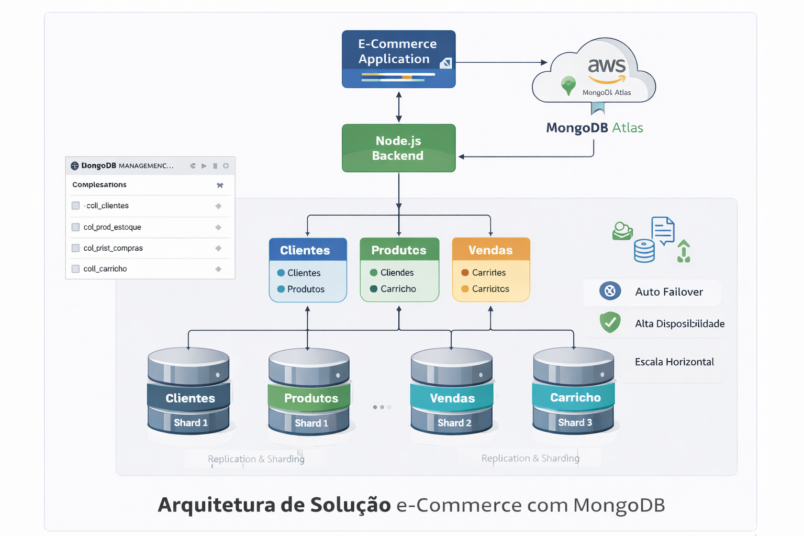
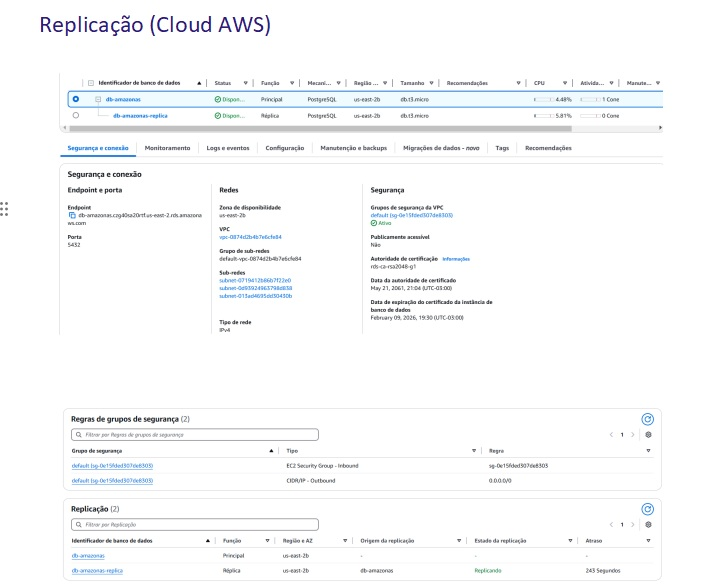
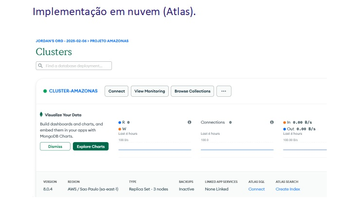
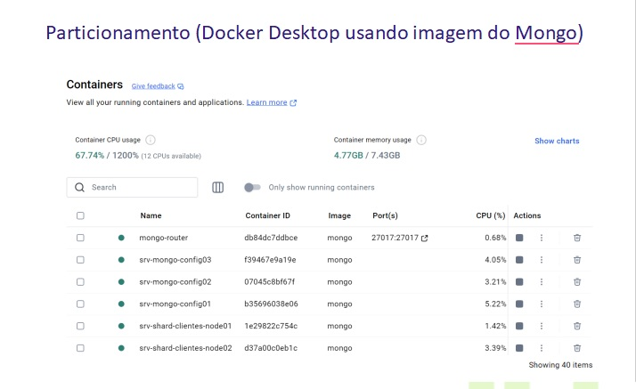

# Modelagem de Dados Não Relacional com MongoDB e AWS

## 📌 Visão Geral
Este projeto apresenta uma solução de **modelagem de dados não relacional** para um cenário de e-commerce, utilizando **MongoDB** como banco de dados principal e **MongoDB Atlas na AWS** como ambiente de implantação.

A proposta considera requisitos de **escalabilidade**, **alta disponibilidade** e **flexibilidade de schema**, comuns em aplicações modernas orientadas a dados.

---

## 🎯 Objetivos do Projeto
- Modelar dados utilizando o paradigma orientado a documentos (NoSQL)
- Definir estruturas eficientes para leitura e escrita
- Aplicar conceitos de *embedding* e *reference*
- Explorar replicação e particionamento de dados
- Implantar a solução em ambiente cloud (MongoDB Atlas / AWS)

---

## 🛠️ Tecnologias Utilizadas
- MongoDB
- MongoDB Atlas
- AWS
- Modelagem NoSQL
- Conceitos de Replicação e Sharding

---

## 🧱 Arquitetura da Solução
A arquitetura foi projetada para suportar um ambiente de e-commerce escalável, com dados distribuídos e alta disponibilidade.

---

## 🗂️ Modelo de Dados (NoSQL)
O modelo lógico foi definido considerando os principais padrões de acesso do sistema, priorizando desempenho e simplicidade operacional.

Principais coleções:
- Clientes
- Produtos e Estoque
- Carrinho
- Vendas
- Histórico de Compras

---

## 🔁 Replicação
A solução utiliza **Replica Sets** para garantir:
- Alta disponibilidade
- Tolerância a falhas
- Continuidade das operações

---

## 🧩 Particionamento (Sharding)
O particionamento dos dados permite escalabilidade horizontal, distribuindo o volume de dados entre múltiplos nós.

---

## ☁️ Implantação em Cloud (MongoDB Atlas)
A solução foi implantada no MongoDB Atlas utilizando infraestrutura na AWS, com recursos gerenciados de:
- Monitoramento
- Backup
- Escalabilidade
- Segurança

---

## 📂 Documentação Complementar
- [Contexto e Objetivo](docs/01-contexto-e-objetivo.md)
- [Estratégia de Modelagem NoSQL](docs/02-modelagem-nosql.md)
- [Coleções e Estruturas](docs/03-colecoes-e-estruturas.md)
- [Replicação e Particionamento](docs/04-replicacao-e-particionamento.md)
- [Implantação no Atlas](docs/05-implantacao-atlas.md)

---

## ✅ Considerações Finais
Este projeto demonstra a aplicação prática de conceitos de modelagem NoSQL e arquitetura distribuída, com foco em soluções escaláveis e alinhadas às necessidades de sistemas modernos de e-commerce.

O repositório tem como objetivo servir como **portfólio técnico**, evidenciando decisões de arquitetura e modelagem de dados.
